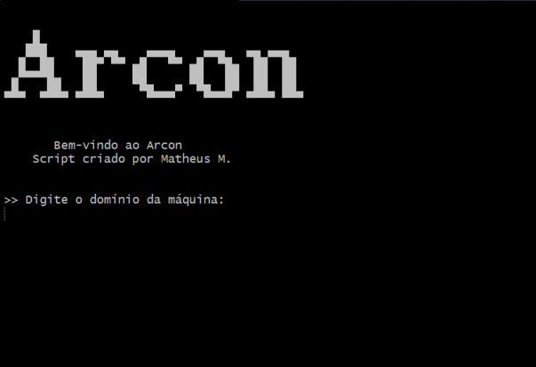
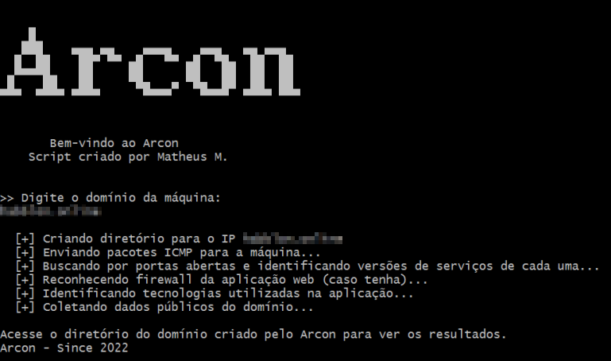

<p align="center">
 
</p>

<hr>

## 📓 Sobre o Arcon
O **Arcon** é um script escrito em português e desenvolvido em Shell Script. <br>
Feito para automatizar e facilitar a etapa de reconhecimento em aplicações web e nos demais IP's para pesquisadores e analistas de segurança. O script foi criado com o intuito de colocar em prática o meu aprendizado e também contribuir com os profissionais e entusiastas da área de **Segurança da Informação** de alguma forma.

Este projeto está aberto para melhorias, sugestões e pull requests, sofrerá atualizações e correções sempre que for possível e sempre que houver possibilidades.
Antes de utilizar, recomendo fortemente que leia a [licença do Arcon](https://github.com/teuscode/arcon/blob/main/LICENSE.md) para que possua conhecimento da mesma.

O desenvolvedor deste script **NÃO** se responsabiliza pelo mau uso deste programa, sendo assim, use-o por sua conta em risco. <br>
A partir do momento que usar o **Arcon**, você é o responsável pela forma como ele vai ser usado.

## 🔩 Funcionamento do Arcon
O **Arcon** foi criado para rodar somente em distribuições Linux, o seu ambiente de desenvolvimento foi o **Kali Linux** e para ele funcionar, é necessário que algumas ferramentas estejam instaladas na sua máquina, sendo elas:

- NMap
- WafW00f
- WhatWeb
- Whois

Caso todas estejam instaladas, vá para o tópico de uso logo abaixo.

## 📁 Como baixar e usar o Arcon
**1° Passo**:
Clone o repositório em sua máquina local:

```bash
$ git clone https://github.com/teuscode/arcon.git
```

**2° Passo**:
Entre no diretório do Arcon:
```bash
$ cd arcon
```

**3° Passo**:
Execute o Arcon utilizando o utilitário **sh**:
```bash
$ sh arcon.sh
```

**4° Passo**:
Agora que você executou o Arcon, irá aparecer essa interface:


**5° Passo**:
Estando na interface inicial, coloque o domínio ou o IP alvo e pronto:


Após isso, verifique o diretório criado no caminho onde o script foi executado e verifique os arquivos de texto criados, dentro deles possuem o resultado de cada teste feito.
<hr>

💀 Criado por **Matheus Muniz** | Information Security Analyst and Systems Programmer.
